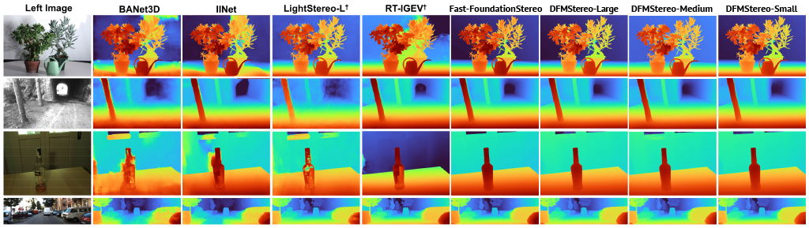

# DFMStereo

**Distilling Foundation Models for Real-Time Stereo Matching**

DFMStereo is a family of lightweight stereo matching architectures — **Small (S)**, **Medium (M)**, and **Large (L)** — distilled from heavy stereo foundation models. Through a multi-stage knowledge distillation pipeline, DFMStereo inherits the strong geometric priors of large foundation models while remaining fast enough for real-time and edge deployment.

<p align="center">
  
</p>
<p align="center">
  <em>Disparity visualizations for all methods except DFMStereo are taken from the Fast-FoundationStereo paper. DFMStereo is trained on less than half the data used by Fast-FoundationStereo.</em>
</p>


---

## Abstract

> Recent foundation models for stereo matching have demonstrated remarkable zero-shot generalization capabilities across diverse domains. However, their massive computational requirements often prevent real-time deployment on edge devices. In this work, we propose a family of DFMStereo architectures, namely Small (S), Medium (M), and Large (L), designed to inherit the robust geometric priors of heavy foundation models through a multi-stage knowledge distillation pipeline. Our framework supervises the student across four key architectural points: multi-scale features, hybrid cost volumes, initial disparity logits, and the iterative refinement sequence. By employing these distillation points, our student models successfully bridge the performance gap between real-time architectures and foundation models. Experimental results on Middlebury, ETH3D, and KITTI benchmarks demonstrate that our models achieve significantly superior zero-shot generalization compared to existing real-time methods. Specifically, DFMStereo-M operates at 38 ms per frame, providing an optimal balance for real-time applications. Furthermore, our approach shows enhanced robustness on non-Lambertian surfaces as evidenced by the Booster dataset. Our code and pre-trained models will be made publicly available.

<!-- Optional: paper / project page / bibtex links -->
<!-- [Paper](link) | [Project Page](link) | [BibTeX](#citation) -->

---

## Environment Setup

DFMStereo was developed and tested with **Python 3.12**, **PyTorch 2.6.0 (CUDA 12.4)**, and **CUDA 12.4**. We recommend using **conda** (via Miniconda) to reproduce the exact environment, since the CUDA/PyTorch build and a few native dependencies (e.g. `xformers`, `open3d`, `pyrealsense2`) are easiest to manage that way.

### Option A: Conda (recommended)

1. Install [Miniconda](https://docs.conda.io/en/latest/miniconda.html) if you don't already have it.
2. Clone the repository and create the environment from the provided `environment.yml`:

```bash
git clone https://github.com/<your-username>/DFMStereo.git
cd DFMStereo

conda env create -f environment.yml
conda activate dfmstereo
```

This will install PyTorch 2.6.0 with CUDA 12.4 support, along with all dependencies used for training, evaluation, and the real-time demo (e.g. `timm`, `einops`, `wandb`, `open3d`, `pyrealsense2`).

### Option B: Pip / venv

If you prefer `pip`, you can install into a virtual environment using the exported `requirements.txt`:

```bash
python3.12 -m venv .venv
source .venv/bin/activate

pip install -r requirements.txt
```

> **Note:** the `pip` route does not automatically pin the CUDA build of PyTorch. If `pip install -r requirements.txt` does not select the CUDA 12.4 wheels for your system, install PyTorch first following the instructions at [pytorch.org](https://pytorch.org/get-started/locally/), for example:
>
> ```bash
> pip install torch==2.6.0 torchvision==0.21.0 --index-url https://download.pytorch.org/whl/cu124
> ```
>
> then install the remaining dependencies from `requirements.txt`.

### GPU requirements

- CUDA 12.4 compatible GPU and driver
- Tested with NVIDIA GPUs; `xformers` and `nvidia-*` CUDA packages are installed automatically via conda/pip

---

## Pre-trained Models

We provide pre-trained checkpoints for all three DFMStereo variants (**S**, **M**, **L**), distilled from foundation stereo models and evaluated for zero-shot generalization on Middlebury, ETH3D, KITTI, and Booster.
Link to all checkpoints: [Link](https://drive.google.com/drive/folders/1gXnIVgJGynq-gJjMexx6iOBBvm8gC504?usp=drive_link)+

| Model         | Params  | Runtime (per frame) | Download |
|---------------|:-------:|:-------------------:|:--------:|
| DFMStereo-S   | 16.65 M |         36 ms       | [Link](https://drive.google.com/file/d/1CEhjIUmLe3__rO9im0LNa64_5aEfpFaR/view?usp=drive_link) |
| DFMStereo-M   | 12.21 M |         33 ms       | [Link](https://drive.google.com/file/d/1nctoWLi-FZmVekz-jS3TeUH_WvpTQLz1/view?usp=drive_link) |
| DFMStereo-L   | 14.16 M |         35 ms       | [Link](https://drive.google.com/file/d/1am49D8scIzqjMzeON34TGhtMlcZCVxah/view?usp=drive_link) |

Inference Times are obtained on NVIDIA RTX 3090 using torch.compile(dfmstereo, 'max-autotune'). Slower infernce times on the Small variant are likely due to lack of optimization.
To download and set up the pre-trained weights (Both SceneFlow and Million-Scale):

```bash
mkdir -p checkpoints
cd checkpoints

# Example — replace with actual download links / script
wget <https://drive.google.com/file/d/1l9g42OTjpbZz5HKfOBWCC654a9MAt4rt/view?usp=drive_link>
wget <https://drive.google.com/file/d/1am49D8scIzqjMzeON34TGhtMlcZCVxah/view?usp=drive_link>
wget <https://drive.google.com/file/d/1nctoWLi-FZmVekz-jS3TeUH_WvpTQLz1/view?usp=drive_link>
wget <https://drive.google.com/file/d/19yJ5O4Tp-vGZYibkIztBSGiH39ZiJV7i/view?usp=drive_link>
wget <https://drive.google.com/file/d/1CEhjIUmLe3__rO9im0LNa64_5aEfpFaR/view?usp=drive_link>
wget <https://drive.google.com/file/d/1mgQe7SWlne8LfOwyl0gYv_2r5VvnFr4Z/view?usp=drive_link>

cd ..
```

## Real-Time Demo (Intel RealSense)
 
DFMStereo can run in real time directly on stereo pairs streamed from an **Intel RealSense** camera. The demo script requires the Intel RealSense SDK (`librealsense`) to be installed on your system in addition to the `dfmstereo` conda environment.
 
### Supported platforms
 
- Ubuntu 20.04 LTS
- Ubuntu 22.04 LTS
- Ubuntu 24.04 LTS

### Requirements
 
- An Intel RealSense stereo camera (e.g. D400 series)
- Intel RealSense SDK (`librealsense`) installed on the system (see below)
- The `dfmstereo` conda environment (includes `pyrealsense2`)
- A downloaded DFMStereo checkpoint (see [Pre-trained Models](#pre-trained-models))
- Atleast a NVIDIA RTX 3070 or a comparable graphics card to run the demo at a decent frame-rate

### 1. Install the Intel RealSense SDK
 
Install `librealsense` from source following Intel's official instructions for your Ubuntu version:
 
👉 [Linux Ubuntu installation from source](https://dev.realsenseai.com/installation/linux-ubuntu-installation-from-source/)
 
### 2. Install the conda environment
 
If you haven't already set up the environment (see [Environment Setup](#environment-setup)):
 
```bash
conda env create -f environment.yml
```
 
### 3. Activate the environment
 
```bash
conda activate dfmstereo
```
 
### 4. Download a pre-trained checkpoint
 
```bash
mkdir -p checkpoints && cd checkpoints
wget <download-link-for-dfmstereo-m.pth>
cd ..
```
 
(see [Pre-trained Models](#pre-trained-models) for links to all variants)
 
### 5. Run the demo
 
```bash
python demo_realsense.py \
  --model dfmstereo-m \
  --checkpoint checkpoints/dfmstereo-m.pth \
  --device cuda:0
```
 
This will open a live window showing the RGB stream alongside the predicted disparity map in real time.


 
<!-- Optional: embed a demo video/GIF once available -->
<!--
<p align="center">
  
</p>
-->
 
<!--
Or link to a hosted video:
📺 [Watch the real-time demo](https://youtube.com/your-video-link)
-->
 
---


## Citation

If you find DFMStereo useful in your research, please consider citing:

```bibtex
@article{dfmstereo,
  title   = {DFMStereo: Distilling Foundation Models for Real-Time Stereo Matching},
  author  = {TODO},
  journal = {TODO},
  year    = {2026}
}
```

## Acknowledgements

<!-- Add acknowledgements / related works here -->

## License

<!-- Add license information here -->
